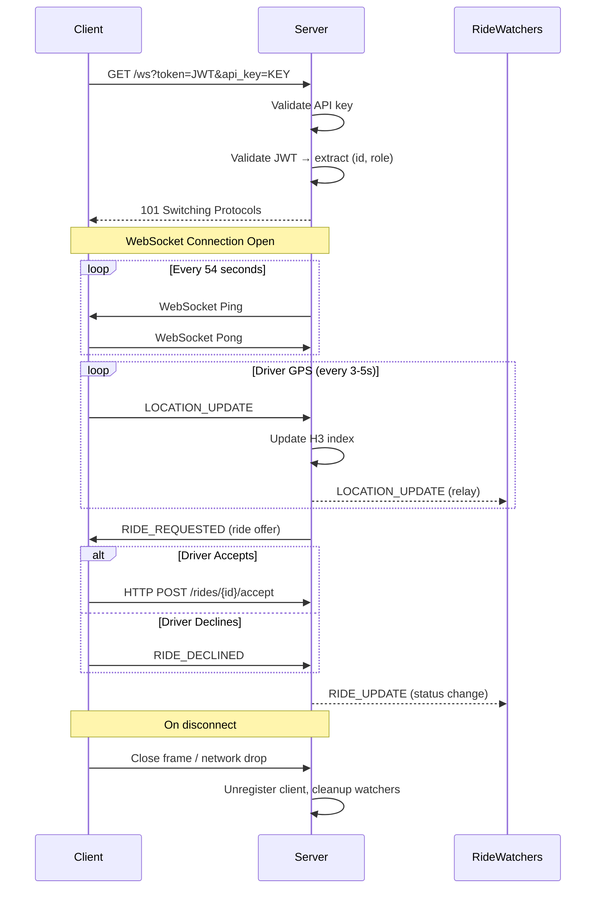

# Ambigo V2 — WebSocket Documentation

## Overview

The Ambigo V2 backend uses a single WebSocket endpoint for all real-time communication. It powers:
- **Driver location tracking** (H3 spatial index)
- **Ride lifecycle events** (request → accept → arrive → start → complete/cancel)
- **Push notifications** to connected clients
- **Session management** (single-device enforcement)

---

## Endpoint

| Property | Value |
|----------|-------|
| **URL** | `ws://<host>/ws?token=<jwt>&api_key=<key>` |
| **Protocol** | WebSocket (RFC 6455) |
| **Upgrade** | HTTP → WebSocket |
| **Origin** | Any (CORS: all origins allowed for mobile apps) |

---

## Authentication

Authentication is performed during the HTTP upgrade handshake via **query parameters**:

| Parameter | Required | Description |
|-----------|----------|-------------|
| `api_key` | ✅ | Application API key (same value as `X-API-Key` header in REST) |
| `token` | ✅ | JWT access token obtained from login/verify-otp endpoints |

### Authentication Flow
```
Client                                Server
  |                                     |
  |--- GET /ws?token=X&api_key=Y -->    |
  |                                     |-- Validate API key
  |                                     |-- Parse & validate JWT
  |                                     |-- Extract: user_id, role, admin_role
  |<-- 101 Switching Protocols ---------|
  |                                     |-- Register client in hub
  |          (WebSocket open)           |
```

### Error Responses (Before Upgrade)
| Status | Cause |
|--------|-------|
| 401 | Missing or invalid `api_key` |
| 401 | Missing `token` parameter |
| 401 | Invalid or expired JWT token |

---

## Message Format

All messages use a JSON envelope:

```json
{
  "type": "EVENT_TYPE",
  "payload": { ... }
}
```

The `type` field determines the event, and `payload` contains the event-specific data as a JSON object.

---

## Client → Server Messages

### 1. `LOCATION_UPDATE`

**Purpose**: Driver sends continuous GPS coordinates (every 3-5 seconds).

**Roles**: `driver` only (ignored from other roles)

```json
{
  "type": "LOCATION_UPDATE",
  "payload": {
    "lat": 17.385044,
    "lng": 78.486671
  }
}
```

**Server Behavior**:
1. Updates the H3 spatial index with driver position
2. On first ping, caches the driver's `vehicle_type` from the database
3. If driver has an active ride, relays location to all ride watchers
4. Publishes `driver:location_update` event on the internal EventBus

---

### 2. `WATCH_RIDE`

**Purpose**: Subscribe to real-time updates for a specific ride.

**Roles**: `user`, `driver`, `admin`

```json
{
  "type": "WATCH_RIDE",
  "payload": {
    "ride_id": "668a1b2c3d4e5f6a7b8c9d0e"
  }
}
```

**Server Behavior**: Adds the client to the ride's watcher set. The client will receive all `RIDE_UPDATE` and `LOCATION_UPDATE` events for that ride.

---

### 3. `RIDE_DECLINED`

**Purpose**: Driver declines an offered ride.

**Roles**: `driver`

```json
{
  "type": "RIDE_DECLINED",
  "payload": {
    "ride_id": "668a1b2c3d4e5f6a7b8c9d0e"
  }
}
```

**Server Behavior**: Forwards to the `DeclineHandler` (dispatcher), which removes this driver from the candidate list and offers the ride to the next nearest available driver.

---

### 4. `PING`

**Purpose**: Application-level keepalive (separate from WebSocket protocol ping).

```json
{
  "type": "PING",
  "payload": {}
}
```

Also accepted as raw text: `ping`

**Server Behavior**: Ignored silently. The server handles protocol-level ping/pong automatically.

---

## Server → Client Messages

### 1. `RIDE_REQUESTED`

**Target**: Specific driver (matched by the dispatcher)

**Purpose**: Offers a new ride to a nearby available driver.

```json
{
  "type": "RIDE_REQUESTED",
  "payload": {
    "ride_id": "668a1b2c3d4e5f6a7b8c9d0e",
    "user_id": "668a0a1b2c3d4e5f6a7b8c9d",
    "pickup_lat": 17.385044,
    "pickup_lng": 78.486671,
    "pickup_address": "Charminar, Hyderabad",
    "dropoff_lat": 17.445045,
    "dropoff_lng": 78.348671,
    "drop_address": "KIMS Hospital, Secunderabad",
    "eta_seconds": 480,
    "distance_km": 12.5,
    "pickup_distance_km": 2.3,
    "fare": 750.50,
    "cost": 600.40,
    "payment_mode": "cash",
    "is_sos": false
  }
}
```

| Field | Type | Description |
|-------|------|-------------|
| `ride_id` | string | Ride ObjectID |
| `user_id` | string | Requesting user's ID |
| `pickup_lat/lng` | float | Pickup coordinates |
| `pickup_address` | string | Human-readable pickup address |
| `dropoff_lat/lng` | float | Drop-off coordinates |
| `drop_address` | string | Human-readable drop address |
| `eta_seconds` | int | Estimated trip duration |
| `distance_km` | float | Trip distance |
| `pickup_distance_km` | float | Distance from driver to pickup |
| `fare` | float | Total fare (for user) |
| `cost` | float | Driver's share of the fare |
| `payment_mode` | string | `cash` or `online` |
| `is_sos` | bool | Emergency/SOS ride flag |

---

### 2. `RIDE_UPDATE`

**Target**: All ride watchers

**Purpose**: Broadcasts ride status changes through the lifecycle.

#### Ride Accepted
```json
{
  "type": "RIDE_UPDATE",
  "payload": {
    "ride_id": "668a1b2c3d4e5f6a7b8c9d0e",
    "driver_id": "668b1c2d3e4f5a6b7c8d9e0f",
    "status": "ASSIGNED"
  }
}
```

#### Driver Arrived
```json
{
  "type": "RIDE_UPDATE",
  "payload": {
    "ride_id": "668a1b2c3d4e5f6a7b8c9d0e",
    "status": "ARRIVED"
  }
}
```

#### Ride Started
```json
{
  "type": "RIDE_UPDATE",
  "payload": {
    "ride_id": "668a1b2c3d4e5f6a7b8c9d0e",
    "status": "IN_PROGRESS"
  }
}
```

#### Ride Completed
```json
{
  "type": "RIDE_UPDATE",
  "payload": {
    "ride_id": "668a1b2c3d4e5f6a7b8c9d0e",
    "status": "COMPLETED",
    "amount": 750.50
  }
}
```

#### Ride Cancelled
```json
{
  "type": "RIDE_UPDATE",
  "payload": {
    "ride_id": "668a1b2c3d4e5f6a7b8c9d0e",
    "status": "CANCELLED"
  }
}
```

#### Ride Cancelled (No Drivers Available)
```json
{
  "type": "RIDE_UPDATE",
  "payload": {
    "ride_id": "668a1b2c3d4e5f6a7b8c9d0e",
    "status": "CANCELLED",
    "available_types": ["BLS", "ALS"]
  }
}
```

---

### 3. `LOCATION_UPDATE` (Server → Client)

**Target**: Ride watchers

**Purpose**: Relays the assigned driver's GPS position during an active ride.

```json
{
  "type": "LOCATION_UPDATE",
  "payload": {
    "lat": 17.390012,
    "lng": 78.490134
  }
}
```

---

### 4. `ERROR`

**Target**: Specific user

**Purpose**: Notifies the user of an error (e.g., no drivers available).

```json
{
  "type": "ERROR",
  "payload": {
    "message": "All nearby drivers are busy. Please try again.",
    "available_types": ["BLS", "ALS"]
  }
}
```

---

### 5. `SESSION_REPLACED`

**Target**: Old client being kicked

**Purpose**: Sent when a new connection with the same `(role, id)` connects.

```json
{"type":"SESSION_REPLACED"}
```

After this message, the connection is immediately closed.

---

## Connection Lifecycle



---

## Connection Parameters

| Parameter | Value |
|-----------|-------|
| Read Buffer Size | 1024 bytes |
| Write Buffer Size | 1024 bytes |
| Max Message Size | 1024 bytes |
| Send Channel Buffer | 256 messages |
| Ping Interval | 54 seconds |
| Pong Timeout | 60 seconds |
| Write Timeout | 10 seconds |

---

## Error Codes

| Error | Description |
|-------|-------------|
| HTTP 401 | Invalid API key during handshake |
| HTTP 401 | Missing token during handshake |
| HTTP 401 | Invalid/expired JWT token |
| `SESSION_REPLACED` | Another client connected with same credentials |
| `ERROR` (WS message) | Application-level error (e.g., no drivers) |
| Connection Close | Pong timeout (60s), write error, or server shutdown |

---

## Testing Instructions

### Using Postman WebSocket Client
1. Open Postman → New → WebSocket Request
2. URL: `ws://localhost:8080/ws?token=<YOUR_JWT>&api_key=<YOUR_API_KEY>`
3. Click **Connect**
4. In the message composer, send JSON messages as documented above

### Using wscat (CLI)
```bash
npm install -g wscat
wscat -c "ws://localhost:8080/ws?token=YOUR_TOKEN&api_key=YOUR_KEY"
```

### Using Browser DevTools
```javascript
const ws = new WebSocket('ws://localhost:8080/ws?token=YOUR_TOKEN&api_key=YOUR_KEY');
ws.onopen = () => console.log('Connected');
ws.onmessage = (e) => console.log('Received:', JSON.parse(e.data));
ws.send(JSON.stringify({ type: 'WATCH_RIDE', payload: { ride_id: 'YOUR_RIDE_ID' } }));
```
